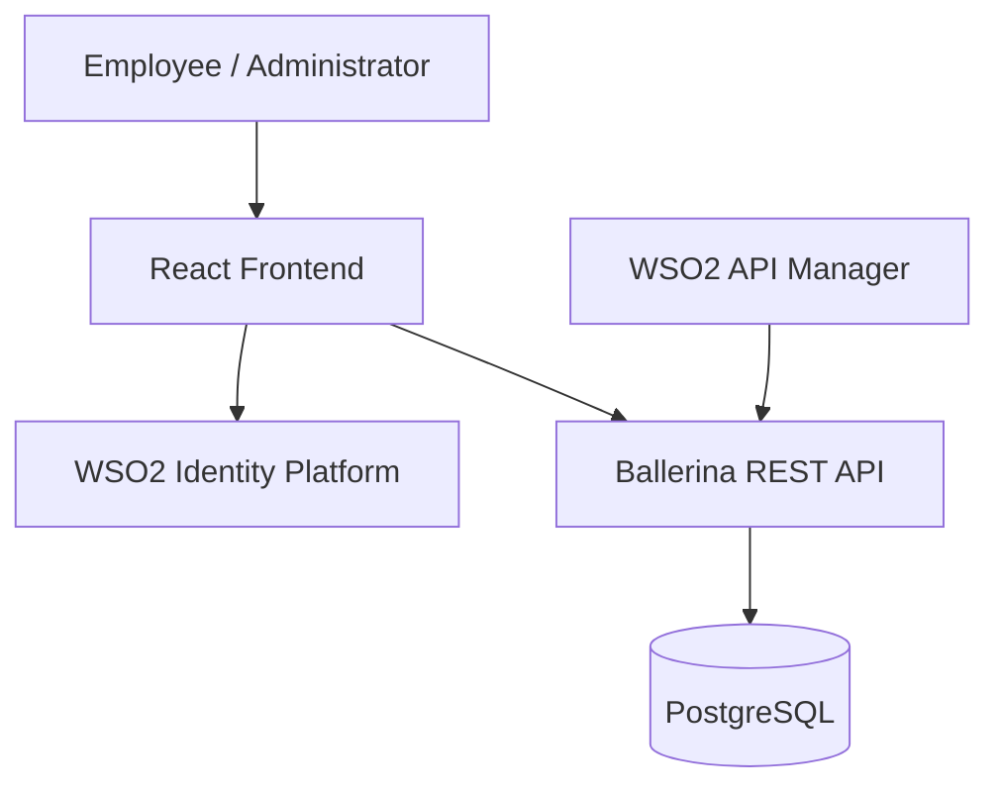

# GrantFlow

### Just-in-Time Access Management for Engineering Teams

GrantFlow is a full-stack access management application that allows employees to request temporary access to sensitive engineering resources while giving administrators control over approval, rejection, revocation, and automatic expiration.

The project was built as a learning implementation of modern identity, role-based access control, API management, backend development, and containerized database infrastructure using WSO2 technologies.

---

## Problem

Engineering teams often need temporary access to production systems, deployment tools, logs, databases, or internal dashboards.

A common problem is that temporary access becomes permanent because access is not revoked after the original task is completed.

GrantFlow addresses this by introducing a simple Just-in-Time access workflow:

```text
Employee requests access
        ↓
      PENDING
        ↓
 Admin reviews request
     ↙        ↘
 REJECTED    ACTIVE
                ↓
        Temporary access
                ↓
             EXPIRED
```

Administrators can also manually revoke active access:

```text
ACTIVE → REVOKED
```

---

## Features

### Employee

- Sign in using WSO2 Identity Platform
- View protected engineering resources
- Request temporary access
- Select access duration
- Provide a reason for requesting access
- View only personal access requests
- Track request status
- View live access expiration countdown

### Administrator

- Separate Admin Dashboard
- Role-based access using `GrantFlow Admin`
- View pending access requests
- Approve requests
- Reject requests
- View active access grants
- Revoke active access
- Monitor remaining access duration

### Access Lifecycle

GrantFlow currently supports:

```text
PENDING → ACTIVE
PENDING → REJECTED
ACTIVE  → REVOKED
ACTIVE  → EXPIRED
```

Access automatically expires when the approved duration is reached.

---

## Architecture



### Current Local Development Flow

```text
React
  ↓
WSO2 Identity Platform
  ↓
Ballerina REST API
  ↓
PostgreSQL
```

WSO2 API Manager is also configured and has been tested successfully as a managed gateway in front of the Ballerina API.

> During local development, the React frontend currently calls the Ballerina backend directly on `localhost:8080`. API Manager integration has been configured and independently verified through its gateway.

---

## Technology Stack

### Frontend

- React
- Vite
- React Router
- Axios
- CSS

### Backend

- Ballerina
- REST API

### Database

- PostgreSQL 16
- SQL

### Infrastructure

- Docker
- Docker Compose

### Identity & API Management

- WSO2 Identity Platform
- WSO2 Application Roles
- WSO2 API Manager 4.7.0
- OAuth2 / OpenID Connect

---

## Role-Based Access Control

GrantFlow currently has two user experiences.

### Normal User

A normal user can access:

```text
/
```

A normal user can:

- view protected resources
- request temporary access
- view personal requests
- monitor request status

Normal users cannot access:

```text
/admin
```

If a normal user manually attempts to open `/admin`, they are redirected to the employee dashboard.

### Administrator

A user assigned the:

```text
GrantFlow Admin
```

WSO2 application role receives access to:

```text
/admin
```

Administrators can:

- approve requests
- reject requests
- revoke active access
- monitor active access grants

---

## Protected Resources

The development database includes the following sample protected resources:

| Resource | Description |
|---|---|
| Production Logs | Access to production application logs |
| Deployment Console | Access to deployment management tools |
| Customer Database | Read-only access to customer data |
| Finance Dashboard | Access to internal finance reports |

---

## Project Structure

```text
GrantFlow/
│
├── backend/
│   ├── main.bal
│   ├── Ballerina.toml
│   └── ...
│
├── frontend/
│   ├── src/
│   │   ├── pages/
│   │   │   ├── UserDashboard.jsx
│   │   │   └── AdminDashboard.jsx
│   │   ├── App.jsx
│   │   ├── AuthGate.jsx
│   │   └── App.css
│   └── package.json
│
├── database/
│   └── init.sql
│
├── docs/
│   ├── api-manager.md
│   └── grantflow-openapi.yaml
│
├── docker-compose.yml
├── .gitignore
└── README.md
```

---

## API Endpoints

The Ballerina backend exposes the following REST endpoints.

### Health Check

```http
GET /health
```

### Protected Resources

```http
GET /resources
```

### Access Requests

```http
GET /access-requests
```

```http
POST /access-requests
```

Example request:

```json
{
  "requesterEmail": "employee@example.com",
  "resourceId": 1,
  "reason": "Investigating a production issue",
  "durationMinutes": 30
}
```

Example response:

```json
{
  "message": "Access request created successfully",
  "requestId": 13,
  "status": "PENDING"
}
```

### Approve Request

```http
POST /access-requests/{id}/approve
```

Example response:

```json
{
  "message": "Access request approved successfully",
  "requestId": 13,
  "status": "ACTIVE",
  "approvedAt": "2026-10-02 17:02:08.085254",
  "expiresAt": "2026-10-02 17:32:08.085254"
}
```

### Reject Request

```http
POST /access-requests/{id}/reject
```

### Revoke Access

```http
POST /access-requests/{id}/revoke
```

### Check Access

```http
GET /access-requests/{id}/access
```

Example response:

```json
{
  "requestId": 13,
  "access": true,
  "status": "ACTIVE",
  "expiresAt": "2026-10-02 17:32:08.085254"
}
```

---

## WSO2 Integration

### WSO2 Identity Platform

WSO2 Identity Platform is used for user authentication and role information.

The frontend retrieves authenticated user claims through the OpenID Connect UserInfo endpoint.

GrantFlow uses:

```text
email
username
roles
```

The application role:

```text
GrantFlow Admin
```

is used to determine whether the authenticated user can access the Admin Dashboard.

---

### WSO2 API Manager

GrantFlow's Ballerina REST API has also been published through WSO2 API Manager.

#### API Details

```text
Name: GrantFlowAPI
Version: 1.0.0
Context: /grantflow
```

#### Backend Endpoint

```text
http://localhost:8080
```

#### Gateway

```text
https://localhost:8243/grantflow/1.0.0
```

The following routes were configured in API Manager:

```text
GET  /health
GET  /resources
GET  /access-requests
POST /access-requests
POST /access-requests/{id}/approve
POST /access-requests/{id}/reject
POST /access-requests/{id}/revoke
GET  /access-requests/{id}/access
```

The following flow was successfully tested through the WSO2 gateway:

```text
Create Request
      ↓
   PENDING
      ↓
   Approve
      ↓
    ACTIVE
      ↓
 Access Check
      ↓
 access: true
```

See:

```text
docs/api-manager.md
docs/grantflow-openapi.yaml
```

for the API Manager configuration and OpenAPI definition.

---

## Local Setup

### Prerequisites

Install:

- Node.js
- npm
- Ballerina
- Docker Desktop
- Java 21
- WSO2 API Manager 4.7.0

---

### 1. Clone the Repository

```bash
git clone <YOUR_REPOSITORY_URL>
cd GrantFlow
```

---

### 2. Start PostgreSQL

From the project root:

```bash
docker compose up -d
```

Check the container:

```bash
docker compose ps
```

---

### 3. Start the Ballerina Backend

```bash
cd backend
bal run
```

Backend:

```text
http://localhost:8080
```

Test:

```text
http://localhost:8080/health
```

Expected response:

```json
{
  "status": "healthy",
  "serviceName": "grantflow-api"
}
```

---

### 4. Configure the Frontend

Inside:

```text
frontend/
```

create:

```text
.env
```

Add:

```env
VITE_WSO2_CLIENT_ID=your_wso2_client_id
VITE_WSO2_BASE_URL=your_wso2_base_url
```

Example:

```env
VITE_WSO2_BASE_URL=https://api.asgardeo.io/t/your-organization
```

> Never commit your real `.env` file.

---

### 5. Start the React Frontend

```bash
cd frontend
npm install
npm run dev
```

Frontend:

```text
http://localhost:5173
```

---

## Starting WSO2 API Manager

GrantFlow was tested using WSO2 API Manager 4.7.0 with Java 21.

On Windows:

```powershell
cd C:\wso2\wso2am-4.7.0
.\bin\api-manager.bat
```

Publisher Portal:

```text
https://localhost:9443/publisher
```

The local development certificate is self-signed, so the browser may display a security warning.

---

## Example User Flow

### Employee

```text
Sign In
   ↓
View Protected Resources
   ↓
Request Access
   ↓
Select Duration
   ↓
Provide Reason
   ↓
Request becomes PENDING
```

### Administrator

```text
Sign In
   ↓
Open Admin Dashboard
   ↓
Review Pending Request
   ↓
Approve
   ↓
Request becomes ACTIVE
```

### Expiration

```text
ACTIVE
   ↓
Expiration time reached
   ↓
EXPIRED
   ↓
access = false
```

---

## Security Notes

GrantFlow currently demonstrates frontend role-based routing using WSO2 roles.

The Admin Dashboard is protected in the frontend:

```text
/admin
```

Normal users are redirected away from this route.

However, frontend route protection alone is not sufficient for production security.

A production implementation should additionally enforce authorization at the API or backend layer.

---

## Current Limitations

GrantFlow is currently a learning MVP.

The following production capabilities are not yet implemented:

- backend JWT validation
- server-side role authorization
- fine-grained API scopes
- persistent audit logs
- automated integration tests
- email or notification service
- CI/CD pipeline
- full frontend/backend containerization
- production deployment configuration

---

## Future Improvements

### Security

- Validate WSO2 access tokens in Ballerina
- Enforce administrator roles on admin API endpoints
- Introduce OAuth scopes
- Add policy-based access control

### Observability

- Access audit logs
- Request history
- Administrative activity logs
- Metrics and monitoring

### Platform

- Dockerize the frontend
- Dockerize the Ballerina backend
- Add CI/CD using GitHub Actions
- Deploy to a cloud platform

### User Experience

- Notifications
- Request comments
- Search and filtering
- Admin analytics
- Access history
- Additional protected resource categories

---

## What This Project Demonstrates

GrantFlow demonstrates practical experience with:

- full-stack web application development
- React
- Ballerina
- REST APIs
- PostgreSQL
- Docker
- authentication
- OpenID Connect
- role-based access control
- WSO2 Identity Platform
- WSO2 API Manager
- API gateway configuration
- OpenAPI
- temporary access lifecycle management

---

## Project Status

**Functional MVP completed.**

```text
React Frontend              ✅
Ballerina Backend           ✅
PostgreSQL                  ✅
Docker                      ✅
WSO2 Authentication         ✅
Employee Dashboard          ✅
Admin Dashboard             ✅
Role-Based Routing          ✅
Approval Workflow           ✅
Rejection Workflow          ✅
Revocation Workflow         ✅
Automatic Expiration        ✅
WSO2 API Manager            ✅
OpenAPI Definition          ✅
```

---

> **GrantFlow — Temporary access should actually be temporary.**